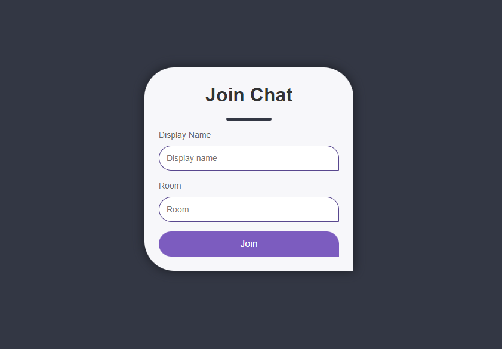
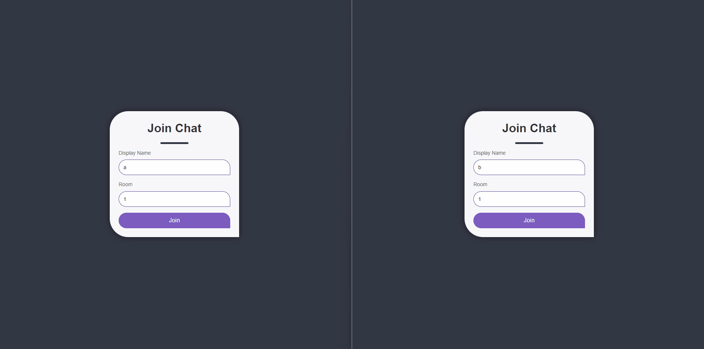

  
  <h3 align="center">Chat Fuss</h3>
  

    <strong>Chat Fuss</strong> is a free chat room website where you can have live chat with others,
    any time you can start a private conversation, share your location,
    images, and voice notes.No download, no setup & no registration is needed.
     
     
    <a href="https://github.com/MahmoudSharaf55/Chat-Fuss/issues/new">Have a bug</a>
    &nbsp~&nbsp
    <a href="https://github.com/MahmoudSharaf55/Chat-Fuss/issues/new">Have a new feature</a>
     

  

## Screenshots

     

## Features

|                      Features                      |
| :---------------------------------------------------- |
| No limit of users on room |
| No Registrations | 
| No Data Stored | 
| Share Images |
| Share Voice notes |
| Share Location |
| Awesome user interface |

## Development Environment

* Developed using Node.js
* Node.js 12.9.0

## Creator

[**Ma7MOoOD SHaRaF**](https://github.com/MahmoudSharaf55)

## Copyright and license

Code and documentation copyright 2020 the authors.

Thanks
